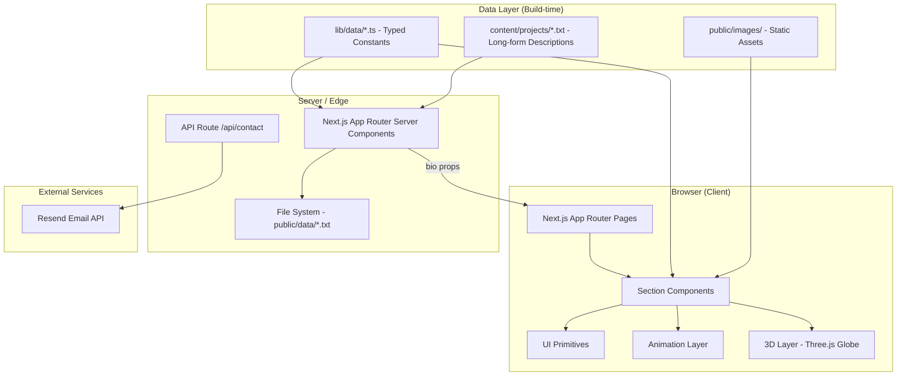

<div align="center">
  

  # Personal Portfolio

  **[raphaelonana.dev](https://raphaelonana.dev)**

  
</div>

---

A personal portfolio website built to present my work, background, and contact information in a visually engaging way. The site uses scroll-driven animations, a 3D globe, a real-time contact form, and a dark/light theme system with three selectable accent colours.

---

## Architecture Overview

The application follows a layered architecture where the data layer is fully decoupled from the presentation layer. All content lives in typed TypeScript constants; no CMS or database is involved for static content. The contact form is the only runtime data path, which routes through a serverless API handler.



### Request lifecycle

When a visitor opens the site, Next.js renders the top-level page as a server component. It reads the bio paragraphs from `public/data/bio.txt` at request time and passes them as props to the Hero section. All other sections receive their data from the typed constants in `src/lib/data/` which are bundled at build time. Client components hydrate in the browser, starting scroll-triggered animations once each section enters the viewport.

When a visitor submits the contact form, the browser POSTs JSON to `/api/contact`. The route handler validates the payload, calls the Resend API with the visitor's message, and returns a success or error response. The form shows an animated success overlay on delivery.

---

## System Design

### Component architecture

The site is divided into four top-level sections, each self-contained in its own directory under `src/components/`:

**Navbar** handles theme toggling, accent colour selection, and responsive mobile navigation. The accent picker stores the user's selection in a React context that applies a class to the `<html>` element, switching the active CSS variable set.

**Hero** is the landing view. It contains a Three.js particle background, a rotating skill cube, an animated bio card, and a photo card. The bio text is server-read from a plain text file, making it editable without touching any component code.

**About** is split into three tabs: a narrative timeline of alternating photo and prose blocks, an experience zig-zag timeline, and an education year-selector with course banners. All content is data-driven from separate data files.

**Projects** renders a prioritised, filterable masonry grid. Each project card supports a live URL, a GitHub link, and a video demo link. Featured projects link to dedicated detail pages whose long-form body text is read from `content/projects/{slug}.txt` at build time.

**Contact** combines a VS Code-style typewriter terminal, a Resend-powered contact form, an interactive 3D globe with five North American city markers, a floating social dock, and an animated meteor shower backdrop.

### Data flow

```mermaid
flowchart LR
  A[lib/data/*.ts] -->|imported at build| B[Section Components]
  C[public/data/bio.txt] -->|readFileSync at request| D[page.tsx server component]
  D -->|bio prop| E[Hero > BioCard]
  F[content/projects/*.txt] -->|readFileSync at build| G[Project detail pages]
  H[Contact Form UI] -->|fetch POST| I[/api/contact]
  I -->|Resend SDK| J[Email delivery]
```

### Theming system

Every colour in the design is a CSS custom property defined on `:root` (light mode) and `.dark` (dark mode). Three accent themes are toggled by adding a class to `<html>`: `.accent-violet`, `.accent-cyan`, or `.accent-amber`. This means no component ever hardcodes a colour; they all reference `var(--accent)`, `var(--glass)`, `var(--fg)`, and so on.

### Animation strategy

Entry animations use Framer Motion `whileInView` with `once: true` so they fire once as each section scrolls into view. Complex choreography in the Hero section uses GSAP timelines for fine-grained sequencing. Mouse-driven parallax on accent orbs also uses GSAP for smooth interpolation. The 3D globe is a custom Three.js canvas rendered inside a React component with a `useEffect` lifecycle.

---

## Sections and Use Cases

### Hero

The hero section gives a first impression. The typewriter role cycle, animated bio card, and 3D particle background are intended to communicate personality and technical range at a glance. A visitor can immediately see the name, current role, and call-to-action buttons for the resume and contact section.

### About

The about section tells the story behind the resume. The narrative timeline walks through key life and academic moments with paired photos. The experience tab shows a zig-zag career timeline with company logos and bullet-point responsibilities. The education tab lets a visitor browse courses by year, giving context for academic depth. The hobbies tab adds a human dimension beyond professional credentials.

### Projects

The projects grid is the portfolio centrepiece. Projects are sorted by priority and then by recency. Featured projects take a wider card format. Each card shows a preview image, a short description, the technology tags, and links to the live site, source code, and video demo when available. Detail pages provide longer write-ups for significant projects.

### Contact

The contact section is the conversion point for recruiters and collaborators. It provides a direct email form (powered by Resend), a social links dock, and a 3D globe that visualises the cities where the author is open to opportunities. The VS Code terminal card on the left reinforces the technical theme while presenting key profile information in a memorable format.

---

## Project Structure

```
src/
  app/
    layout.tsx          Root HTML shell, fonts, theme and accent providers
    page.tsx            Composes all sections; reads bio.txt server-side
    providers.tsx       AccentProvider + ThemeProvider wrappers
    api/contact/        Serverless POST handler for the contact form
    projects/[slug]/    Dynamic detail pages for individual projects
  components/
    navbar/             Desktop and mobile nav, ThemeToggle, AccentPicker
    hero/               Particle background, skill cube, bio card, photo card
    about/              Narrative timeline, experience zig-zag, education tabs
    projects/           Masonry grid and individual project cards
    contact/            Terminal, form, globe, dock, animated background
    ui/                 Shared primitives: GlassCard, TiltCard, MagneticButton,
                        FloatingDock, 3D Globe, Meteors, TextHoverEffect, etc.
  lib/
    data/               All content as typed TypeScript constants
public/
  data/               Plain text files read server-side (bio, etc.)
  images/             Static images organised by section
content/
  projects/           Long-form project descriptions (.txt, one per slug)
```

---

## Discussion Points

This project demonstrates several engineering decisions worth discussing:

**Separation of content from presentation.** Every visible string lives in a typed constant or a plain text file. A content change never requires touching a component. This also means the data layer is fully testable in isolation.

**Progressive enhancement and accessibility.** Animations use `once: true` so users who scroll past a section quickly do not see them repeat. All decorative elements carry `aria-hidden`. Semantic HTML landmarks are used for each section.

**CSS custom properties as the single source of theming truth.** Rather than relying on Tailwind's generated classes for colours, the entire palette is expressed as custom properties. Tailwind utilities are used only for layout and spacing, which means the accent and theme system works across every component without per-component conditionals.

**Server-side file reads in an App Router context.** The bio and project detail texts are read with `readFileSync` inside async server components. This avoids a client-side fetch waterfall and keeps long-form prose editable without a rebuild cycle when used with ISR.

**Three.js inside React.** The globe is a custom Three.js canvas managed entirely in a `useEffect`. Cleanup on unmount disposes all geometries, materials, and the renderer to avoid memory leaks during hot-reloads in development.
